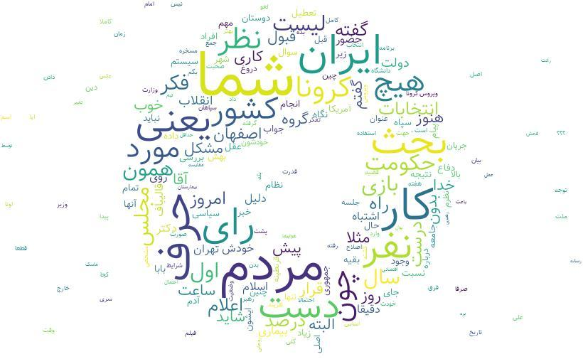

# Persian_wordcloud for Telegram
A code to make wordclouds from all the chats in an specific group or any personal chat using [wordcloud-fa](https://github.com/alihoseiny/word_cloud_fa) !

## How to use
### Using by exporting chats from [Telegram desktop](https://desktop.telegram.org/).
If you dont have Telegram desktop simply download it from [here](https://desktop.telegram.org/).

Go to any group or chat that you want and choose Export chat history from group settings on top right
 of the screen.
Then unmark photos because we dont need photos or any other type of media to make wordcloud and download
 messages as html. when the history downloaded go to the directory in which html files are saved and
 copy the absolute path of the directory. After running program enter the path and wait for it to show 
 you the wordcloud based on your chats. The .txt file of your chats and .png file of your wordcloud
 save on your pc and you can see them.
## Examples

