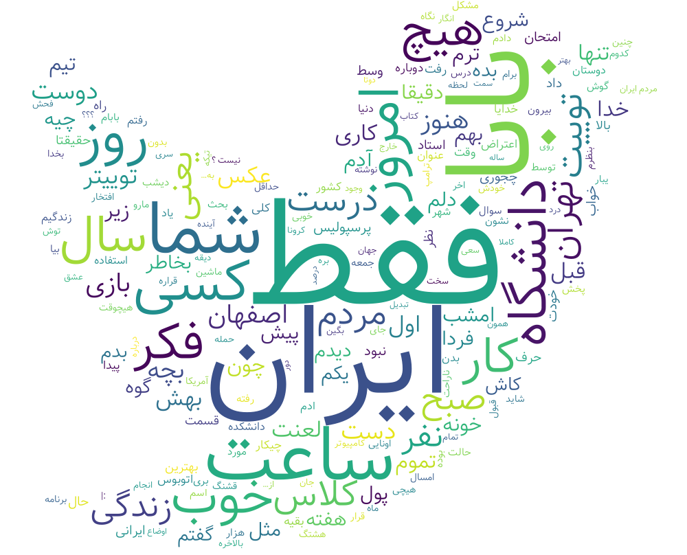
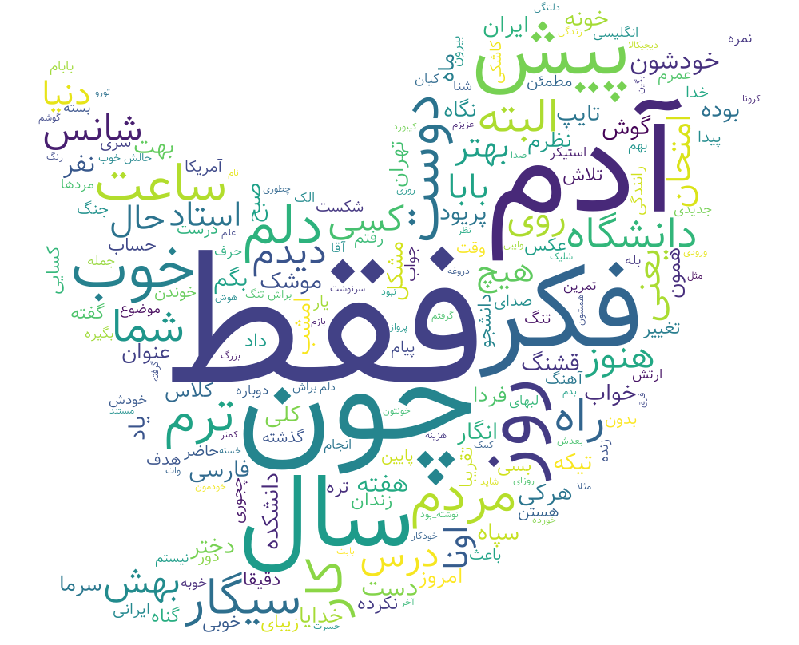

# Persian_wordcloud for twitter
A code to make wordclouds from all tweets of any user on [twitter](twitter.com) using [wordcloud-fa](https://github.com/alihoseiny/word_cloud_fa) and [tweepy](https://github.com/tweepy/tweepy) !

## How to use
### Using twitter APIs
If you have twitter [developer account](https://developer.twitter.com) you can simply enter your keys and tokens in the initial_api function(I read them from a file which APIs are saved there because I didn't want to share them on github :) but it's easy to get them from twitter it just takes at least 2 days!). After that when you run the program enter u when it asks you to choose from username and file and after that enter username of anyone on the twitter. After some minutes it will show and save the photo!

### Without twitter developer account 
Its even easier to use this code without [developer account](https://developer.twitter.com)!

First go [here](https://allmytweets.net) and after logging into your twitter account type id of any user on twitter and choose tweets, after couple of minutes it shows you user's last 3200 tweets and you can simply copy everything and then paste them into a .txt file.

After that run the program and now you just need to enter 'f' when it asks you to choose between file and username and then type the absolute path of the directory in which you save text file of the tweet. After some seconds it shows and saves the picture of your wordcloud!

## Examples

